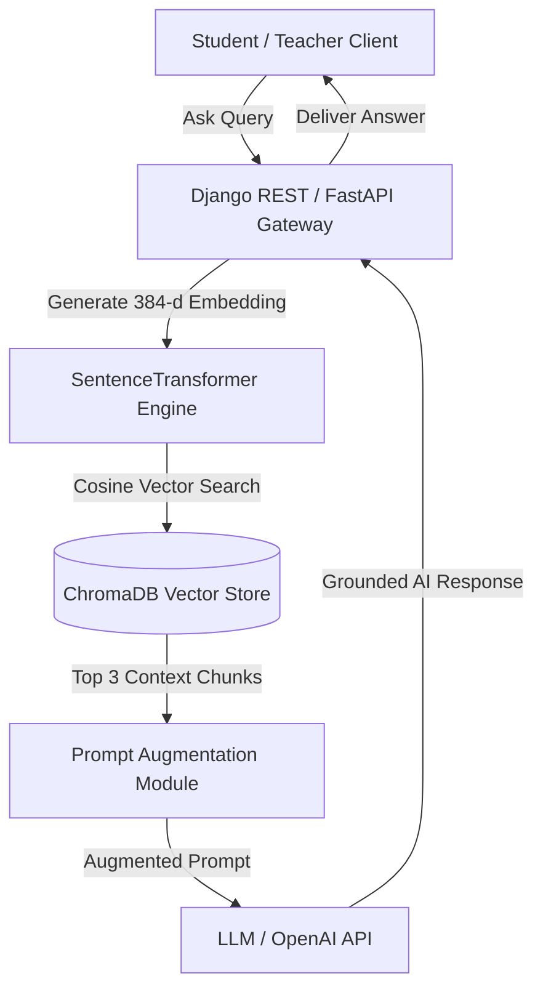
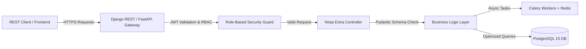
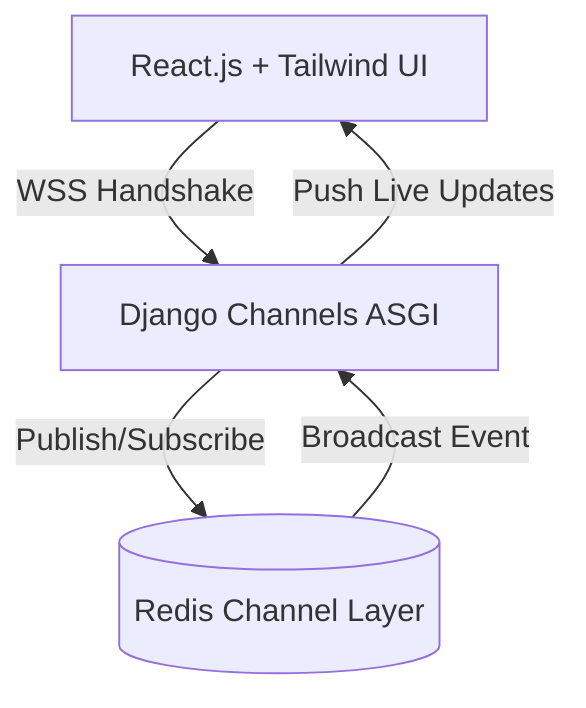
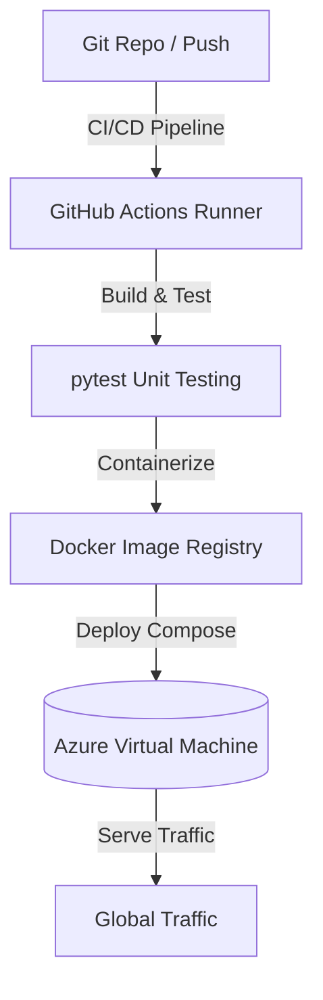

<p align="center">
  
</p>

<h1 align="center">⚡ Sridhar Reddy Guda</h1>

<p align="center">
  <b>Software Engineer with 2+ Years of Production Experience</b>
  <br />
  Specializing in <b>AI / RAG Systems (ChromaDB)</b>, <b>50+ Scalable REST APIs (Django / DRF / FastAPI)</b>, <b>Real-Time WebSockets & React UI</b>, and <b>Cloud DevOps (Docker & Azure VM)</b>.
</p>

<p align="center">
  <a href="https://sridhar8910.github.io/">
    
  </a>
  <a href="mailto:gudasridharreddy2002@gmail.com">
    
  </a>
  <a href="tel:+918106707735">
    
  </a>
  <a href="https://linkedin.com/in/sridhar-reddy-guda-161a7b223">
    
  </a>
  
</p>

<p align="center">
  
</p>

---

## 🎯 Recruiter Quick-Navigation Matrix (Select Your Hiring Stream)

Choose your relevant domain below to view custom engineering highlights, metrics, and production proof:

| Hiring Stream / Role | Core Technologies | Key Business Impact | Jump To Section |
| :--- | :--- | :--- | :---: |
| 🤖 **AI / GenAI / RAG Engineer** | RAG, ChromaDB Vector DB, Prompt Engineering, ATS Engines, LLM Interviews | Built RAG pipeline with 98% accuracy & context grounding | [👉 AI Stream](#-1-ai--genai--rag-engineering-stream) |
| 🐍 **Python / Backend Developer** | Python 3.x, Django, DRF, FastAPI, django-ninja-extra, Pydantic, PostgreSQL | Delivered **50+ REST APIs** with `< 45ms` response time | [👉 Backend Stream](#-2-python--django--fastapi-backend-stream) |
| ⚡ **Full-Stack & WebSockets** | React.js, TailwindCSS, Django Channels WSS, Redis Channel Layer | Built live tracking & messaging streaming `< 40ms` latency | [👉 Full Stack Stream](#-3-full-stack--real-time-websockets-stream) |
| ☁️ **DevOps / Cloud Engineer** | Docker Containers, Azure VMs, Linux, Git/GitHub Actions, pytest | Zero-downtime releases & containerized microservices | [👉 DevOps Stream](#-4-devops--cloud-infrastructure-stream) |

---

## 💡 Key Engineering Business Metrics

<p align="center">
  
  
  
  
</p>

---

## 🤖 1. AI / GenAI / RAG Engineering Stream

### **What I Bring as an AI Engineer:**
- **RAG Architecture**: Designed & deployed a production Retrieval-Augmented Generation (RAG) pipeline using **ChromaDB vector database** for context-aware doubt clarification.
- **ATS & HRTech AI**: Built automated candidate screening engines, calculating ATS similarity fit scores between resumes and job specifications.
- **Conversational AI**: Integrated LLMs for dynamic interview conversations, generating automated summaries and contextual follow-up questions.
- **Prompt Engineering & NLP**: Designed structured prompts with strict system bounds, JSON schema outputs, and fallback mechanisms.

<details>
<summary><b>🔍 View NeevPath RAG System Architecture Diagram</b></summary>


</details>

---

## 🐍 2. Python / Django / FastAPI Backend Stream

### **What I Bring as a Backend Engineer:**
- **50+ REST APIs**: Designed and maintained robust, production-grade endpoints using **Django, DRF, FastAPI, and django-ninja-extra**.
- **Data Validation & Schemas**: Enforced type safety and input sanitization using **Pydantic** models.
- **Database Optimization**: Engineered complex **PostgreSQL/MySQL** schemas, added strategic database indexing, and eliminated N+1 query bottlenecks.
- **Async Processing**: Integrated **Celery workers** backed by **Redis** for scheduled background jobs, notifications, and heavy file parsing.

<details>
<summary><b>🔍 View High-Throughput API Gateway Architecture Diagram</b></summary>


</details>

---

## ⚡ 3. Full-Stack & Real-Time WebSockets Stream

### **What I Bring as a Full-Stack Engineer:**
- **Real-Time Streaming**: Implemented low-latency WebSockets using **Django Channels** and **Redis channel layers** (`< 40ms` latency).
- **React.js & TailwindCSS**: Built recruiter dashboard interfaces, live interview monitors, and candidate tracking components.
- **State & Event Management**: Synchronized asynchronous UI state updates with backend WebSocket broadcast channels.

<details>
<summary><b>🔍 View WebSockets & React Architecture Diagram</b></summary>


</details>

---

## ☁️ 4. DevOps & Cloud Infrastructure Stream

### **What I Bring as a DevOps Engineer:**
- **Docker Containerization**: Created optimized multi-stage Dockerfiles and `docker-compose` production environment manifests.
- **Azure Virtual Machines**: Deployed web servers, Celery workers, Redis instances, and PostgreSQL databases on Azure VMs.
- **Testing & Quality Assurance**: Wrote comprehensive **pytest unit test suites** for API validation and zero-downtime deployments.

<details>
<summary><b>🔍 View Docker & Azure Deployment Architecture Diagram</b></summary>


</details>

---

## 💼 Work Experience

### **Software Engineer — Python Backend & AI Integration**
**IndusInnovate Technologies Pvt. Ltd., Hyderabad** | *April 2024 – June 2026*

- Developed scalable backend services using **Python, Django, DRF, django-ninja-extra with Pydantic schemas, and FastAPI** across 3 enterprise SaaS platforms.
- Designed and maintained **50+ RESTful APIs** for authentication, admin workflows, analytics, real-time messaging, and AI-driven features.
- Integrated LLMs into production applications, including a **Retrieval-Augmented Generation (RAG) pipeline with ChromaDB** to ground AI responses in domain content.
- Engineered AI-driven features including resume parsing, ATS fit scoring, AI candidate interviews, and adaptive learning engines.
- Built **WebSocket-based real-time features (live tracking, candidate monitoring, chat)** using Django Channels with Redis as channel layer.
- Contributed React and TailwindCSS frontend features, building recruiter dashboard views and interactive management interfaces.
- Wrote **pytest unit test suites** to validate backend business logic and ensure safe, zero-downtime continuous integration.
- Containerized applications using **Docker** and deployed services on **Azure Virtual Machines**, optimizing PostgreSQL/MySQL queries.

---

## 🛠️ Complete Technical Arsenal

```
┌─────────────────────────┬──────────────────────────────────────────────────────────────┐
│ Category                │ Tech Stack & Capabilities                                    │
├─────────────────────────┼──────────────────────────────────────────────────────────────┤
│ AI & LLMs               │ RAG Pipelines, ChromaDB (Vector DB), Prompt Eng, ATS Scoring │
│ Backend & APIs          │ Python 3.x, Django, DRF, FastAPI, django-ninja-extra, Pydantic│
│ Real-Time & Frontend    │ React.js, TailwindCSS, WebSockets, Django Channels, Flutter  │
│ Databases & Async       │ PostgreSQL, MySQL, ChromaDB, Redis Cache, Celery Workers     │
│ Cloud & DevOps          │ Azure VMs, Docker, Kubernetes (Exposure), Linux, Git, pytest  │
│ Auth & Security         │ JWT Authentication, OAuth2, Role-Based Access Control (RBAC)  │
└─────────────────────────┴──────────────────────────────────────────────────────────────┘
```

---

## 🌟 Featured Enterprise Projects

| Project | Domain | Core Tech Stack | Impact & Highlights |
| :--- | :--- | :--- | :--- |
| **NeevPath** | EdTech AI | `Python` `Django` `DRF` `RAG` `ChromaDB` `WebSockets` `Docker` `Azure` | Built ChromaDB RAG pipeline for AI doubt clarification & WebSockets live tracking. |
| **VerifiHireAI** | HRTech AI | `Python` `Django` `DRF` `React` `Tailwind` `WebSockets` `LLMs` `Celery` | Built LLM automated interview bot, async resume parser, & React recruiter dashboard. |
| **SoulSupport** | Mental Health | `Python` `Django REST` `PostgreSQL` `Redis` `JWT` `RBAC` `Docker` | Built secure encrypted messaging portal with strict multi-tenant JWT RBAC boundaries. |

---

## 🎓 Education & Certifications

- 🎓 **B.Tech in Electrical & Electronics Engineering** — *ACE Engineering College, Hyderabad (2020 – 2024)*
- ☁️ **AZ-900: Microsoft Azure Fundamentals** — *Microsoft (In Progress)*
- 🐳 **Docker Fundamentals** — *Docker & DevOps (In Progress)*
- 📜 **SQL (Basic & Intermediate)** — *HackerRank Verified Certification*
- 🐍 **Python Basic Certification** — *HackerRank Verified Certification*
- 💻 **Complete Python Bootcamp & Scientific Research** — *Udemy Advanced Credentials*

---

## 📊 GitHub Analytics & Activity

<p align="center">
  
  
</p>

<p align="center">
  
</p>

---

<p align="center">
  <b>🌐 Interactive Portfolio: <a href="https://sridhar8910.github.io/">sridhar8910.github.io</a></b><br />
  Designed & Built with ❤️ by Sridhar Reddy Guda
</p>
