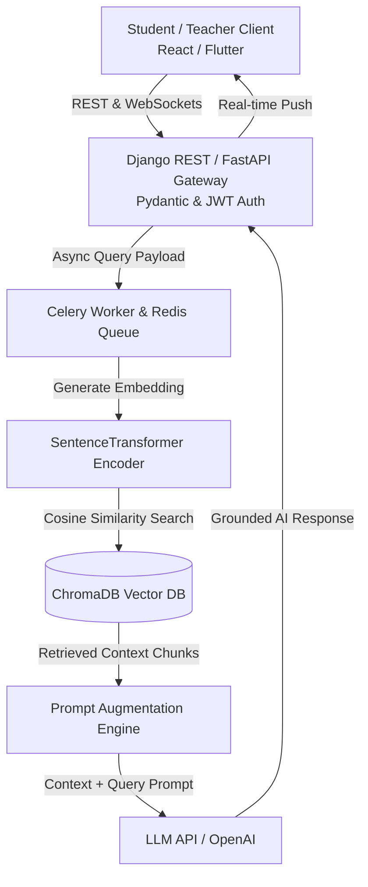
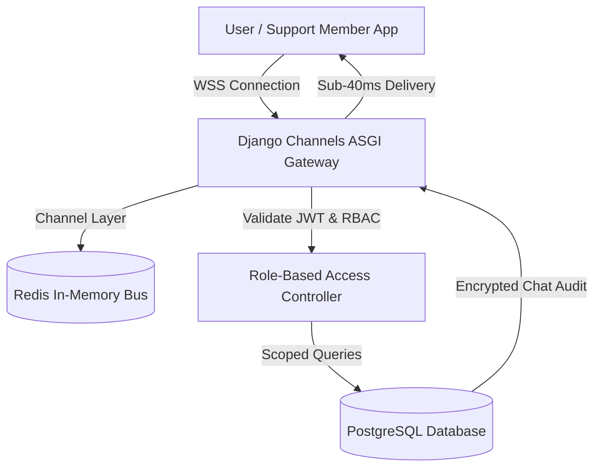

  

<h1 align="center">⚡ Hi, I'm Sridhar Reddy Guda</h1>

  <b>AI Developer & Python Backend Engineer</b> specializing in <b>Retrieval-Augmented Generation (RAG)</b> with <b>ChromaDB</b>, <b>50+ Production REST APIs</b>, <b>Real-time WebSockets</b>, and <b>Cloud DevOps (Docker & Azure VM)</b>.

  
  
  
  
  

  

---

## 🚀 Executive Summary

Software Engineer with **2+ years of experience** building AI-powered SaaS platforms and scalable Python backends. Hands-on experience integrating Large Language Models (LLMs) into production systems, including designing a **Retrieval-Augmented Generation (RAG) pipeline with ChromaDB** for a context-aware doubt-clarification assistant.

Delivered **50+ REST APIs** across EdTech, HRTech, and Mental Wellness platforms, with production experience in prompt engineering, AI workflow design, real-time WebSockets (Django Channels), React frontends, JWT/OAuth authentication, PostgreSQL/MySQL query optimization, Docker containerization, and Azure Virtual Machines.

---

## 🏛️ System Architectures

### 1. NeevPath — AI RAG Pipeline & Smart School ERP

### 2. VerifiHireAI — AI Recruitment & Interview Automation Pipeline

```mermaid
flowchart LR
    A[Recruiter Uploads Resumes] -->|File Upload Endpoint| B[Django Async Endpoint]
    B -->|Task Queue| C[Celery Workers + Redis]
    C -->|Parse Text & Extraction| D[NLP Resume Parser]
    D -->|Match against Job Spec| E[ATS Fit Scoring Engine]
    E -->|Vector Store Query| F[(ChromaDB Index)]
    F -->|Candidate Ranking| G[React + Tailwind Dashboard]
    G -->|Interactive WebSockets| H[AI Live Interviewer Session]
```

### 3. SoulSupport — Real-Time WebSocket & Security Architecture

---

## 💼 Work Experience

### **Software Engineer — Python Backend & AI Integration**
**IndusInnovate Technologies Pvt. Ltd., Hyderabad** | *April 2024 – June 2026*

- Developed scalable backend services using **Python, Django, DRF, django-ninja-extra with Pydantic schemas, and FastAPI** across three enterprise SaaS platforms.
- Designed and maintained **50+ RESTful APIs** for authentication, admin workflows, analytics, communication, and AI-driven features.
- Integrated LLMs into production applications, including a **Retrieval-Augmented Generation (RAG) pipeline with ChromaDB** to ground AI responses in domain content.
- Built AI-driven features including resume parsing, ATS scoring, candidate ranking, and adaptive learning support engines.
- Implemented **WebSocket real-time features (live tracking and chat)** using Django Channels with Redis as the channel layer.
- Contributed React and TailwindCSS frontend features, collaborating on recruiter-facing dashboards.
- Wrote **pytest unit tests** to validate backend logic and support safe continuous integration.
- Containerized applications using **Docker** and deployed services on **Azure Virtual Machines**.
- Implemented **Celery and Redis-backed asynchronous processing** for scheduled jobs and AI triggers.

---

## 🛠️ Technical Arsenal

| Category | Technologies & Tools |
| --- | --- |
| **AI & LLM Integration** | RAG Pipelines, ChromaDB (Vector DB), Prompt Engineering, LLM Integration, ATS Scoring Engines, AI Interview Automation, NLP |
| **Backend & APIs** | Python 3.x, Django, DRF, FastAPI, Flask, django-ninja-extra, Pydantic, REST APIs, WebSockets, gRPC, C++ |
| **Frontend & Real-Time** | React.js, TailwindCSS, WebSockets (Django Channels), JavaScript (ES6+), HTML5/CSS3, Flutter Integration |
| **Databases & Async** | PostgreSQL, MySQL, ChromaDB, Redis Cache, Celery Workers, Database Design & Query Optimization |
| **DevOps & Cloud** | Azure Virtual Machines, Docker, Kubernetes (Exposure), Apache Beam (Exposure), Linux/Bash, Git, GitHub Actions |
| **Security & Testing** | JWT Authentication, OAuth2, Role-Based Access Control (RBAC), pytest Unit Testing |

---

## 🌟 Featured Enterprise Projects

### 🎓 **NeevPath — AI-Powered Smart School Management Platform**
*`Python` `Django` `DRF` `RAG` `ChromaDB` `WebSockets` `PostgreSQL` `Celery` `Redis` `Docker` `Azure`*
- Built a **Retrieval-Augmented Generation (RAG) pipeline** using ChromaDB to power an AI doubt-clarification assistant delivering contextually grounded explanations.
- Built **WebSocket-based real-time features** for live tracking and chat, using Django Channels with Redis.
- Built an AI assessment engine that generates quizzes, evaluates answers, and identifies learning gaps.
- Designed secure REST APIs using JWT authentication for student, teacher, parent, and admin roles.

### 💼 **VerifiHireAI — Enterprise AI Recruitment Platform**
*`Python` `Django` `DRF` `React` `TailwindCSS` `WebSockets` `LLMs` `Celery` `Redis` `Docker` `Azure VM`*
- Integrated LLMs for AI-powered interview conversations, candidate evaluation, and automated interview summaries.
- Built React frontend features styled with TailwindCSS for recruiter dashboards and candidate management views.
- Implemented WebSockets for live interview monitoring and Celery async resume screening workflows.

### 💖 **SoulSupport — Secure Human Emotional Support Platform**
*`Python` `Django` `DRF` `REST APIs` `PostgreSQL` `Celery` `Redis` `JWT` `RBAC` `Docker` `Azure`*
- Built REST APIs for authentication, private conversations, notifications, admin dashboards, and moderation.
- Implemented JWT authentication and RBAC to secure user, support member, and admin workflows.
- Optimized PostgreSQL queries for encrypted conversation history and low-latency responses.

---

## 🎓 Education & Certifications

- **B.Tech in Electrical and Electronics Engineering** — ACE Engineering College, Hyderabad (2020 – 2024)
- **AZ-900: Microsoft Azure Fundamentals** — *Microsoft (In Progress)*
- **Docker Fundamentals** — *Docker & DevOps (In Progress)*
- **SQL (Basic & Intermediate)** — *HackerRank Verified Certification*
- **Python Basic Certification** — *HackerRank Verified Certification*
- **The Complete Python Bootcamp & Scientific Research** — *Udemy Advanced Credentials*

---

## 📊 GitHub Analytics

  
  

  

---

  <b>🌐 Interactive Portfolio: <a href="https://sridhar8910.github.io/">sridhar8910.github.io</a></b> 
  Designed & Built with ❤️ by Sridhar Reddy Guda

