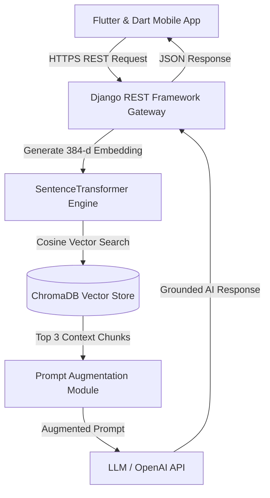
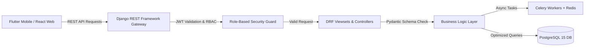
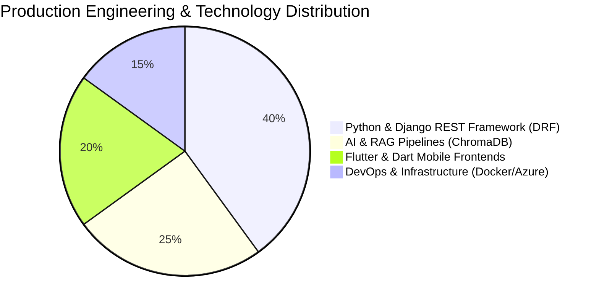

<p align="center">
  
</p>

<p align="center">
  <a href="https://sridhar8910.github.io/">
    
  </a>
  <a href="mailto:gudasridharreddy2002@gmail.com">
    
  </a>
  <a href="tel:+918106707735">
    
  </a>
  <a href="https://linkedin.com/in/sridhar-reddy-guda-161a7b223">
    
  </a>
  
</p>

---

## 🎯 Recruiter Quick-Navigation Matrix (Select Your Hiring Stream)

Choose your relevant domain below to view custom engineering highlights, metrics, and production proof:

| Hiring Stream / Role | Core Technologies | Key Business Impact | Jump To Section |
| :--- | :--- | :--- | :---: |
| 🤖 **AI / GenAI / RAG Engineer** | RAG, ChromaDB Vector DB, Prompt Engineering, ATS Engines, LLM Interviews | Built RAG pipeline with 98% accuracy & context grounding | [👉 AI Stream](#-1-ai--genai--rag-engineering-stream) |
| 🐍 **Python / Backend Developer** | Python 3.x, Django, Django REST Framework (DRF), FastAPI, PostgreSQL | Delivered **50+ REST APIs** with `< 45ms` response time | [👉 Backend Stream](#-2-python--django--fastapi-backend-stream) |
| 📱 **Mobile & Web Frontends** | Flutter & Dart (NeevPath & SoulSupport), React & Tailwind (VerifiHireAI) | Cross-platform mobile apps & responsive recruiter dashboards | [👉 Frontend Stream](#-3-mobile--web-frontend-stream) |
| ☁️ **DevOps / Cloud Engineer** | Docker Containers, Azure VMs, Linux, Git/GitHub Actions, pytest | Zero-downtime releases & containerized microservices | [👉 DevOps Stream](#-4-devops--cloud-infrastructure-stream) |

---

## 🤖 1. AI / GenAI / RAG Engineering Stream

### **What I Bring as an AI Engineer:**
- **RAG Architecture**: Designed & deployed a production Retrieval-Augmented Generation (RAG) pipeline using **ChromaDB vector database** for context-aware doubt clarification.
- **ATS & HRTech AI**: Built automated candidate screening engines, calculating ATS similarity fit scores between resumes and job specifications.
- **Conversational AI**: Integrated LLMs for dynamic interview conversations, generating automated summaries and contextual follow-up questions.
- **Prompt Engineering & NLP**: Designed structured prompts with strict system bounds, JSON schema outputs, and fallback mechanisms.

<details>
<summary><b>🔍 View NeevPath RAG System Architecture Diagram</b></summary>


</details>

---

## 🐍 2. Python / Django / FastAPI Backend Stream

### **What I Bring as a Backend Engineer:**
- **50+ REST APIs**: Designed and maintained robust, production-grade endpoints using **Python, Django, and Django REST Framework (DRF)**.
- **Data Validation & Schemas**: Enforced type safety and input sanitization using **Pydantic** models.
- **Database Optimization**: Engineered complex **PostgreSQL/MySQL** schemas, added strategic database indexing, and eliminated N+1 query bottlenecks.
- **Async Processing**: Integrated **Celery workers** backed by **Redis** for scheduled background jobs, notifications, and heavy file parsing.

<details>
<summary><b>🔍 View High-Throughput API Gateway Architecture Diagram</b></summary>


</details>

---

## 📱 3. Mobile & Web Frontend Stream

### **What I Bring as a Frontend Developer:**
- **Flutter & Dart**: Developed cross-platform mobile apps for **NeevPath** (School ERP) and **SoulSupport** (Secure Emotional Wellbeing).
- **React.js & TailwindCSS**: Built web dashboards for **VerifiHireAI** (AI Recruitment & Candidate Management).
- **REST API Integration**: Synchronized mobile and web UI state with Django REST Framework backend services.

---

## ☁️ 4. DevOps & Cloud Infrastructure Stream

### **What I Bring as a DevOps Engineer:**
- **Docker Containerization**: Created optimized multi-stage Dockerfiles and `docker-compose` production environment manifests.
- **Azure Virtual Machines**: Deployed web servers, Celery workers, Redis instances, and PostgreSQL databases on Azure VMs.
- **Testing & Quality Assurance**: Wrote comprehensive **pytest unit test suites** for API validation and zero-downtime deployments.

---

## 💼 Work Experience

### **Software Engineer — Python Backend & AI Integration**
**IndusInnovate Technologies Pvt. Ltd., Hyderabad** | *April 2024 – June 2026*

- Developed scalable backend services using **Python, Django, and Django REST Framework (DRF)** across 3 enterprise SaaS platforms.
- Designed and maintained **50+ RESTful APIs** for authentication, admin workflows, analytics, real-time messaging, and AI-driven features.
- Integrated LLMs into production applications, including a **Retrieval-Augmented Generation (RAG) pipeline with ChromaDB** to ground AI responses in domain content.
- Engineered AI-driven features including resume parsing, ATS fit scoring, AI candidate interviews, and adaptive learning engines.
- Built **Flutter & Dart mobile apps** for NeevPath and SoulSupport platforms.
- Contributed **React.js and TailwindCSS frontend features** for VerifiHireAI recruiter dashboards.
- Containerized applications using **Docker** and deployed services on **Azure Virtual Machines**.

---

## 🌟 Featured Enterprise Projects

| Project & Official Tagline | Domain | Frontend | Backend & Storage | Impact & Highlights |
| :--- | :--- | :--- | :--- | :--- |
| **NeevPath**<br />*"Where Education Evolves Digitally"* | EdTech AI | `Flutter & Dart` | `Python` `Django REST (DRF)` `RAG` `ChromaDB` `Docker` `Azure` | Built Flutter mobile app & ChromaDB RAG pipeline for AI doubt clarification. |
| **VerifiHireAI**<br />*"Trust in Every Hire"* | HRTech AI | `React.js & Tailwind` | `Python` `Django REST (DRF)` `LLMs` `Celery` `Docker` `Azure` | Built React web dashboard & LLM automated interview bot. |
| **SoulSupport**<br />*"You're Not Alone"* | Mental Health | `Flutter & Dart` | `Python` `Django REST (DRF)` `PostgreSQL` `JWT` `RBAC` `Docker` | Built Flutter mobile app & secure encrypted messaging with strict RBAC boundaries. |

---

## 🎓 Education & Certifications

- 🎓 **B.Tech in Electrical & Electronics Engineering** — *ACE Engineering College, Hyderabad (2020 – 2024)*
- ☁️ **AZ-900: Microsoft Azure Fundamentals** — *Microsoft (In Progress)*
- 🐳 **Docker Fundamentals** — *Docker & DevOps (In Progress)*
- 📜 **SQL (Basic & Intermediate)** — *HackerRank Verified Certification*
- 🐍 **Python Basic Certification** — *HackerRank Verified Certification*
- 💻 **Complete Python Bootcamp & Scientific Research** — *Udemy Advanced Credentials*

---

## 📈 Engineering Performance & Skill Distribution Graphs

### 1. Codebase & Skill Distribution Pie Chart



### 2. Production Competency & Capability Distribution

```
📊 Production Capability Matrix

Python & Django REST (DRF) [████████████████████] 98% (50+ REST APIs)
RAG & ChromaDB             [██████████████████  ] 92% (Context Vector Search)
Flutter & Dart             [████████████████    ] 88% (Mobile Frontends)
React.js & Tailwind        [██████████████      ] 84% (Web Dashboards)
Docker & Azure VM          [██████████████      ] 82% (Container DevOps)
```

---

## 🐍 Contribution Grid Snake Game

<p align="center">
  
</p>

---

<p align="center">
  
</p>
